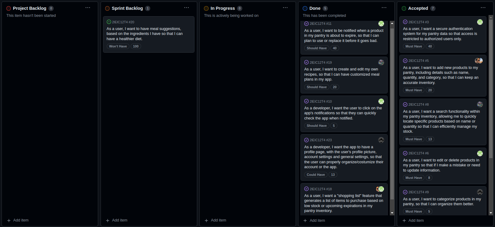

# Smart Pantry Control Mobile App Development Report

Welcome to the documentation pages of our app named **Spantry**!

You can find here details about the Smart Pantry, from a high-level vision to low-level implementation decisions, a kind of Software Development Report, organized by type of activities:

- [Business modeling](#Business-Modelling)
  - [Product Vision](#Product-Vision)
  - [Features](#Features)
  - [Assumptions](#Assumptions)
  - [Elevator Pitch](#Elevator-pitch)
- [Requirements](#Requirements)
  - [Domain model](#Domain-model)
- [Architecture and Design](#Architecture-And-Design)
  - [Logical architecture](#Logical-Architecture)
  - [Physical architecture](#Physical-Architecture)
  - [Vertical prototype](#Vertical-Prototype)
- [Project Management](#Project-Management)

Contributions are expected to be made exclusively by the initial team, but we may open them to the community, after the course, in all areas and topics: requirements, technologies, development, experimentation, testing, etc.

Please contact us!

Thank you!

### Authors

- **Miguel Guerrinha -** up202205038@edu.fe.up.pt
- **Rui Cruz -** up202208011@edu.fe.up.pt
- **Tomás Teixeira -** up202208041@edu.fe.up.pt
- **Tomás Ferreira -** up202002749@edu.fe.up.pt
- **Tomás Telmo -** up202206091@edu.fe.up.pt

---

## Business Modelling

### Product Vision

For busy families seeking a simplified grocery management solution, the Smart Pantry Control is a mobile application that keeps your larder organized and reduces waste by highlighting expiration dates. Unlike general shopping apps, our product specifically targets the reduction of expired products with user-friendly technology and smart notifications.

### Features

#### 1. Product Inventory

- Add, edit, and delete products in the pantry inventory.
- Categorize products for better organization.

#### 2. Expiry Date Tracking

- Set and receive notifications for upcoming product expiration dates.
- Highlight expired or soon-to-expire products.

#### 3. Barcode Scanning

- Utilize barcode scanning functionality for quick and accurate product entry.
- Retrieve product details from an online database.

#### 4. Usage Recommendations

- Receive recommendations on using or discarding products based on their remaining shelf life.

#### 5. User Authentication

- Secure user authentication to ensure data privacy and personalized experiences.

### Assumptions

#### 1. Product Database Availability

- It is assumed that a comprehensive and accessible product database exists for retrieving product details. This database should cover a wide range of products commonly found in pantries and offer reliable data on product names, categories, and expiration periods.

#### 2. Device Capabilities

- The app assumes that the user's device has a camera capable of barcode scanning and receiving notifications. The device should also have sufficient storage to maintain the local pantry inventory and user data securely.

#### 3. External API Integration

- The application assumes the availability and reliability of external APIs for two major functionalities: barcode scanning and user authentication. For barcode scanning, it is presumed that the API can accurately recognize barcodes and fetch product details. For user authentication, the assumption is that the API provides a secure and efficient means to manage user identities and data access.

#### 4. User Compliance

- The app depends on the user's willingness to regularly update the pantry inventory by adding new purchases and removing consumed or discarded items. The effectiveness of expiry date tracking and usage recommendations relies heavily on the accuracy and timeliness of user inputs.

### Elevator Pitch

How many times do we find ourselves going to the fridge or another place where we store our food to see what needs to be replaced or restocked, because it's past its sell-by date or because it's already empty? It can be annoying to have to do all this "manually", but with our **Spantry** app, everything is easier. All you have to do is add or update the products you've bought and we'll do the rest for you, from notifying you when you've run out of a product to when it's past its sell-by date, all with just a few clicks. If you're still not convinced, know that you can also group products by category, for example dairy products, and if you don't want anyone to see what you've been buying, you'll always need a password to enter the application. We look forward to see you using our app!

## Requirements

### Domain model

To better understand the context of the software system, it is very useful to have a simple **UML class diagram** with all the key concepts (names, attributes) and relationships involved of the problem domain addressed by your module.

With this in mind, we designed our UML as follows:

 

  

Starting with the class **User**, it represents an individual who uses the app. Each user has a unique set of credentials and personal information such as username, email and password. 
It receives multiple instances from the **Notification** class which represents messages sent to the user, such as reminders or alerts, and with it, a message associated with a date and time on which the notification was sent. 
The user can also manage multiple products from the **Product** class wich represents a generic type of product that could be stored in the pantry, indicating that a user can add, edit, or delete products in their inventory. 
The **Category** class is just a way to organize products into different groups. 
The **ProductInstance** class represents a specific instance of a product, indicating that each product can have multiple instances with different expiry dates, confirming the relationship where the **Product** contains multiple **ProductInstance** entities. 
Last but not least, the **Recipe** class contains details about recipes that can be made using the products available in the pantry, with their respective instructions. Knowing that either the user or the system itself (in this case, represented by the **RecipeSuggestionSystem** class) can create it, taking into account the products available in the pantry. 
The UML diagram outlines how these entities interact within the Smart Pantry Control app, demonstrating the app's capabilities in managing pantry inventory, tracking product expiry dates, categorizing products, sending user notifications, and integrating products into recipes.

## Architecture and Design

The architecture of a software system encompasses the set of key decisions about its overall organization. 
 This project is structured around several high-level components, which together form a robust product management and control system.
Included will be a **UI** (user interface), referring to the front end of the system, a **business logic**, which is a backend component, designed to be the "heart" of the system, a **database**, necessary for storing and accessing data and **external services**, with which the system will interact in order to take advantage of its functionalities, for example, accessing specific product information by reading a barcode.
These will be discussed later when we introduce both the logical and the physical diagram.

### Logical architecture

  

This logical architecture diagram describes the various components of the Smart Pantry System's software architecture. Unlike a physical diagram, a logical diagram focuses on the logical interrelationships and interactions between different software components without getting into the physical deployment details.

#### 1. Smart Pantry System

- The top-level system that encompasses all the other components of the Smart Pantry application.

#### 2. Business Logic

- The core of the application where the main functions and operations are handled.
- As components has the **User Authentication** which validates the credentials of users trying to access the system to ensure security and privacy; the **Inventory Manager** which manages the products within the user's pantry, handling operations like adding, updating, or deleting items and the **Expiry Tracker** which monitors the expiry dates of products in the inventory and triggers alerts or notifications when products are close to expiring (in these cases, it is programmable by the user how far in advance a notification should be sent) or have expired.

#### 3. User Interface

- This is the layer users interact with, the frontend of the application.
- As components has the **User Dashboard** which is basically the main interface for the user where they can view and manage their pantry inventory, see notifications, and access other features; the **Product View** which allows the user to use a detailed view about information of a specific product in their pantry and the **Notification View** which displays alerts and reminders for the user, such as expiry notifications.

#### 4. Product Database Schema

- Defines the structure of the database where product details and user information are stored. - It iterates with the Business Logic components, particularly the Inventory Manager, to store and retrieve data and is used by the Expiry Tracker to determine which products are nearing expiry and need attention.

#### 5. External Services

- Services that the Smart Pantry System relies on which are not internally hosted.
- As componentes has the **Barcode Lookup Service** queried by the application to get product details from a scanned barcode, and in the future may have additional external services, according to the needs of the application.

In conclusion, the diagram illustrates that the Business Logic uses the User Authentication component to validate user identities, manages inventory through the Inventory Manager, and tracks expiry dates with the Expiry Tracker. The User Interface serves as the "bridge" for interacting with the user, displaying data from the Product Database Schema. The Business Logic retrieves data from and stores data to the database. Lastly, the system queries External Services for additional functionality like barcode lookup, which is outside of the system's internal logic.

### Physical architecture

  

This physical diagram represents the architecture of a software system for the Smart Pantry Control application, showing the components involved and their interactions:

#### 1. Smartphone

- It represents the **user's physical device**, having as artifact, the **App** (the mobile application installed on the user's smartphone, created using Flutter), which is the interface through which the user interacts with the Smart Pantry.

#### 2. Firebase Server Machine

- It's the server where the application's backend processes and services run. It acts as the intermediary between the smartphone app and the data storage or external services (can be a physical server in a data center or a virtual machine in a cloud environment). Has artifacts such as:
- **Firebase UI** that represents the part of the backend responsible for generating and managing the user interface elements that are displayed on the smartphone app and it uses Dart;
- The **Firebase Authentication Service**, used to authenticate users. It manages login sessions and ensures that only authorized users can access their pantry data;
- **Notification Service**, a service that handles the sending of notifications to the user's smartphone, such as expiry alerts or reminders to update inventory;
- **Business Logic** (the compiled code, libraries, and configurations that constitute the application's business logic), represents the core functionality of the app, which includes algorithms and processes for managing inventory, tracking expiration dates and other functionalities that may be implemented;
- **Database Server**, a dedicated server for the database, where all data related to users, products, inventory, etc., are stored, having within it the actual storage component where all application data, such as user profiles, product information, and transaction records, are kept in (**Database**), based in NoSQL.

#### 3. External Services

- Services that the application relies on which are not hosted on the Firebase Server Machine.
- In this case, we have as artifacts the **Barcode Lookup Service**, that is an API used to fetch product information from a barcode number. When a user scans a barcode through the app, this service is queried to retrieve product details from an external database and **Other Services** that might include additional functionalities like external APIs that provide various other features necessary for the app to function.

 In short, this physical diagram outlines the hardware and software components of the Smart Pantry Control system and how they are expected to interact with each other. The user operates the app through their smartphone, which communicates with the backend services on the server machine. The server processes these requests, interacts with the database for storage and retrieval of data, and also communicates with external services for features such as barcode scanning.

### Vertical prototype

To help on validating all the architectural, design and technological decisions made, we usually implement a vertical prototype, a thin vertical slice of the system integrating as much technologies we can.

#### 1. Login

- The first feature we decided to implement was login, in order to protect user data, which is essential in many applications used in our day-to-day lives.

  

#### 2. Reset Password

- Another feature that complements the login, and is useful in cases where the user forgets the password, is the option to reset the password.

  

#### 3. Signup

- For new users, it is important to register with the application via a signup feature.

##### 3.1 Successful Signup

- In this specific case, the user's registration has been accepted.

  

##### 3.2 Unsuccessful Signup

- In this case, registration was refused because the confirmation password was different.

  

##### 3.3 Email Already In Use Signup

  

## Project Management

[Board](https://github.com/orgs/FEUP-LEIC-ES-2023-24/projects/44)

### Sprint #1

*Screenshot of the project board at the start*

  

*Screenshot of the project board at the end*

  

#### Retrospective

- During this sprint, we successfully completed the implementation of authentication in the application, allowing users to log in directly through Google Services or with the email and password. Additionally, we incorporated password recovery functionality. We also implemented the scanning of product barcodes, which allows us to extract information such as name and nutritional data when necessary. This feature is especially useful for adding new products to the user's pantry, optimizing the adding process.
  
However, we faced challenges with the initial organization of the code, namely the way it should be structured, and the configuration in Firebase for saving, editing and deleting products associated with a user, as these were technologies with which we were not yet familiar. In addition, we underestimated the effort required to add products, a task that initially seemed simple but turned out to be complex due to the operations with Firebase. Having overcome these difficulties, we believe that in the next sprints we will have a better understanding of the challenges we may face and a clearer vision of what is possible to implement in a given period of time.
  
Although we have made progress on the project with this sprint, we recognize that if we had anticipated the initial setbacks earlier, we could have achieved even better results.

#### Completed User Stories

- [As a user, I want a secure authentication system for my pantry data so that access is restricted to authorized users only.](https://github.com/orgs/FEUP-LEIC-ES-2023-24/projects/44/views/1?pane=issue&itemId=56979995)
- [As a user, I want to scan product´s barcode, so that I can quickly add them to my pantry.](https://github.com/orgs/FEUP-LEIC-ES-2023-24/projects/44/views/1?pane=issue&itemId=57785171)
- [As a user, I want to add new products to my pantry, including details such as name, quantity, and category, so that I can keep an accurate inventory.](https://github.com/orgs/FEUP-LEIC-ES-2023-24/projects/44/views/1?pane=issue&itemId=56485415)

### Sprint #2

*Screenshot of the project board at the start*

  

*Screenshot of the project board at the end*

  

#### Retrospective

- At the beginning, we believed we could solve all the tasks relatively easily; however, we underestimated the challenges associated with implementing the notifications. Despite several attempts, we were unable to overcome this obstacle. We also had difficulties implementing both the widget and the integration tests, not only because we didn't have the right idea about how they worked, but also because all the functionalities that involve calling and using firebase weren't possible to test.
  
However, this sprint was marked by significantly better team organization, which made it easier to solve most of the planned tasks compared to the previous sprint.

#### Completed User Stories

- [As a user, I want to edit or delete products in my pantry so that if I make a mistake or need to update information.As a user, I want to edit or delete products in my pantry so that if I make a mistake or need to update information.](https://github.com/orgs/FEUP-LEIC-ES-2023-24/projects/44?pane=issue&itemId=56981404)
- [As a user, I want a search functionality within my pantry inventory, allowing me to quickly locate specific products based on name or quantity so that I can efficiently manage my stock.](https://github.com/orgs/FEUP-LEIC-ES-2023-24/projects/44?pane=issue&itemId=56490239)
- [As a user, I want to categorize products in my pantry, so that I can organize them better.](https://github.com/orgs/FEUP-LEIC-ES-2023-24/projects/44?pane=issue&itemId=56981343)
- [As a frequent shopper, I want to create a shopping list based on the items I need to restock in my pantry so that I can be sure I have purchased all the necessary items.](https://github.com/orgs/FEUP-LEIC-ES-2023-24/projects/44?pane=issue&itemId=56980620)

### Sprint #3

*Screenshot of the project board at the start*

  

*Screenshot of the project board at the end*

  

#### Retrospective

- This last sprint, the third in the series, stood out as the most effective in terms of organization, code quality and speed in developing the proposed features. Of particular note was the implementation of the notification system based on the expiry date of products, a task which initially presented us with major challenges.
  
We managed to complete almost all the features planned at the start of the project. The only outstanding feature is the automatic generation of recipes, which would require the support of artificial intelligence or access to an extensive database of recipes, a complexity that would require more time to implement.
  
Overall, the project proved to be extremely enriching. We are pleased to have developed an application that not only meets our initial expectations, but is also functional and perfectly adaptable to everyday use by anyone.

#### Completed User Stories

- [As a user, I want to be notified when a product in my pantry is about to expire, so that I can plan to use or replace it before it goes bad.](https://github.com/orgs/FEUP-LEIC-ES-2023-24/projects/44/views/1?pane=issue&itemId=56487724)
- [As a user, I want to create and edit my own recipes, so that I can have customized meal plans in my app.](https://github.com/orgs/FEUP-LEIC-ES-2023-24/projects/44/views/1?pane=issue&itemId=57885554)
- [As a developer, I want the user to click on the app's notifications so that they can quickly check the app when notified.](https://github.com/orgs/FEUP-LEIC-ES-2023-24/projects/44/views/1?pane=issue&itemId=58026382)
- [As a developer, I want the app to have a profile page, with the user's profile picture, account settings and general settings, so that the user can properly organize/costumize their account or the app.](https://github.com/orgs/FEUP-LEIC-ES-2023-24/projects/44/views/1?pane=issue&itemId=61711450)
- [As a user, I want a "shopping list" feature that generates a list of items to purchase based on low stock or upcoming expirations in my pantry inventory.](https://github.com/orgs/FEUP-LEIC-ES-2023-24/projects/44/views/1?pane=issue&itemId=56490184)